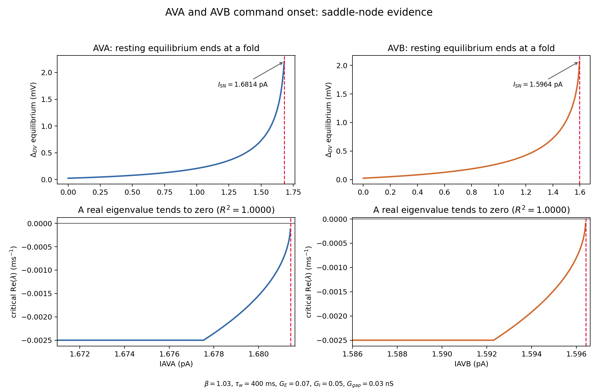
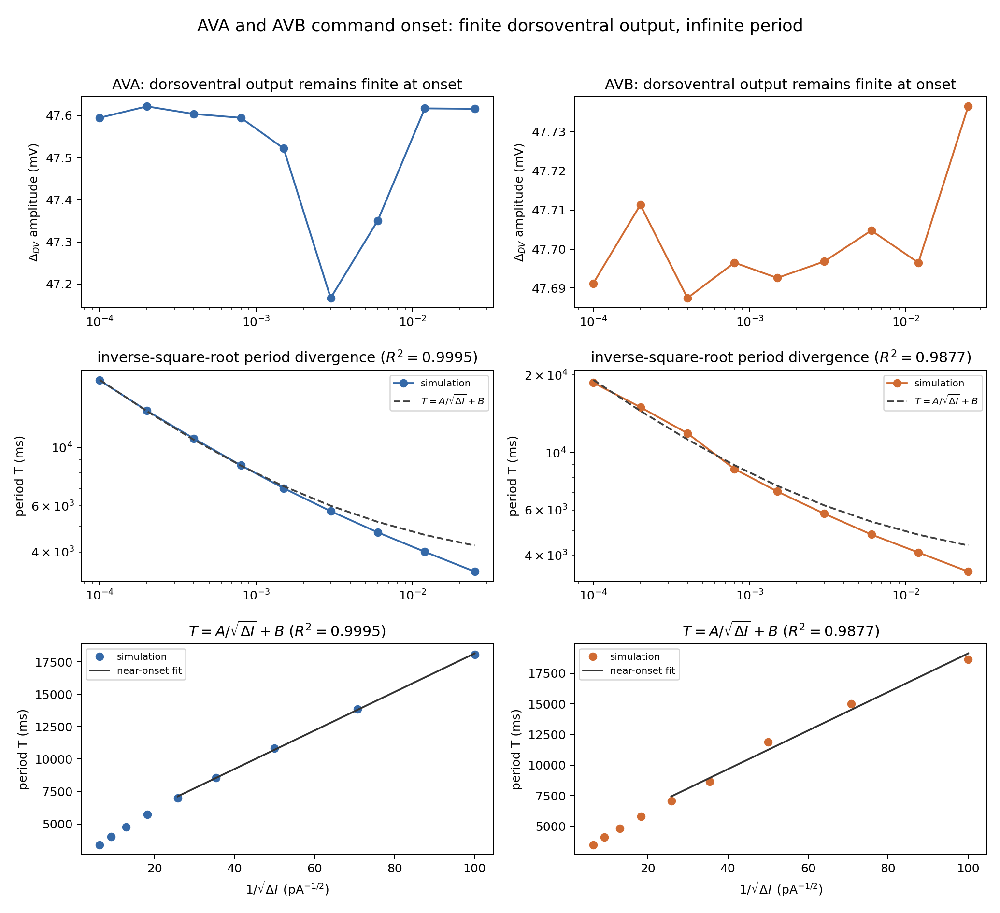

# Why the AVA and AVB drive onsets are SNICs

## Question

What bifurcation creates the segment rhythm as either AVA or AVB command
current is increased from zero?

The analysis uses the reduced 34-state \((V,w)\) representation of the full
17-cell segment. Synaptic fatigue is omitted because it currently evolves
without feeding back into the synaptic current, so it cannot affect the
voltage-recovery bifurcation.

The parameters are

\[
G_{\rm syne}=0.07\ {\rm nS},\quad
G_{\rm syni}=0.05\ {\rm nS},\quad
G_{\rm gap}=0.03\ {\rm nS},
\]

\[
k_{\rm syn}=0.25\ {\rm mV}^{-1},\quad
V_{\rm th}=-52\ {\rm mV},\quad
\beta=1.03,
\quad \tau_w=400\ {\rm ms}.
\]

The recovery time is set to the canonical 400 ms baseline selected on
2026-08-25 from a controlled AVA/AVB dorsoventral-phase sensitivity sweep.
The original 2026-08-18 calculation used 200 ms; recomputation at 400 ms
preserves the equilibrium fold locations and SNIC classification while
changing the realized cycle timescale and muscle output.

## Result

The resting equilibrium terminates at

\[
\boxed{I_{\rm SN}^{\rm AVA}=1.68143\ {\rm pA}},\qquad
\boxed{I_{\rm SN}^{\rm AVB}=1.59643\ {\rm pA}}.
\]

For both commands, four observations identify the transition as a
**saddle-node on invariant circle (SNIC)**:

1. The stable resting equilibrium ends in a fold at the onset current.
2. The critical eigenvalue is real, not a complex conjugate pair, and tends to
   zero at the fold. The saddle-node fits
   \(\lambda^2\propto I_{\rm SN}-I\) have \(R^2=0.99997\) for AVA and
   \(R^2>0.999999\) for AVB.
3. Stable periodic activity exists immediately above the same current and its
   functional dorsoventral amplitude remains finite: approximately 47.6 mV
   under AVA and 47.7 mV under AVB.
4. The period diverges as the fold is approached. Between
   \(\Delta I=0.025\) and \(0.0001\) pA, the AVA period grows from 3.37 to
   18.08 s and the AVB period from 3.46 to 18.66 s. Near onset, the expected
   SNIC form

   \[
   T(\Delta I)=\frac{A}{\sqrt{\Delta I}}+B,
   \qquad \Delta I=I-I_{\rm SN}>0,
   \]

   fits with \(R^2=0.99950\) for AVA and \(R^2=0.98774\) for AVB.

## Figures



The top row follows the resting equilibrium to its termination. The bottom row
zooms into the fold and shows a real eigenvalue approaching zero. A Hopf onset
would instead require a complex pair to cross the imaginary axis.



The cycles do not shrink toward zero amplitude. Instead, their trajectories
remain large while motion through a bottleneck near the vanished equilibria
becomes arbitrarily slow.

## Why the inverse-square-root law is decisive

Near a generic saddle-node, the flow along the center direction has the normal
form

\[
\dot{x}=\mu+a x^2,\qquad \mu=I-I_{\rm SN}.
\]

For \(\mu>0\), the time required to pass through the saddle-node bottleneck is

\[
T_{\rm bottleneck}
\sim \int_{-\infty}^{\infty}\frac{dx}{\mu+a x^2}
=\frac{\pi}{\sqrt{a\mu}}.
\]

The rest of the finite-amplitude orbit contributes a regular time \(B\), giving
\(T=A/\sqrt{\mu}+B\). Consequently the frequency approaches zero continuously,
\(f\sim\sqrt{I-I_{\rm SN}}\), even though the voltage excursion remains large.
That combination—a saddle-node, a finite-amplitude cycle born at the same
parameter, and inverse-square-root infinite-period scaling—is the defining
numerical signature of a SNIC.

This rules out the main alternatives:

- A Hopf bifurcation crosses with a complex eigenvalue pair and has a nonzero
  onset frequency.
- A saddle-homoclinic orbit has logarithmic rather than inverse-square-root
  period divergence and is not tied to the observed equilibrium fold.

## Reproduction

Run from the repository root:

```bash
conda activate simple-worm-scripts
python experiments/drive_snic.py
```

Outputs:

- `media/bifurcation_drive_snic_equilibrium.png`
- `media/bifurcation_drive_snic_cycles.png`
- `media/bifurcation_drive_snic_results.json`

The JSON file records every sampled drive, period, frequency, dorsoventral
amplitude, period method, period CV, fitted fold, and goodness-of-fit statistic.
